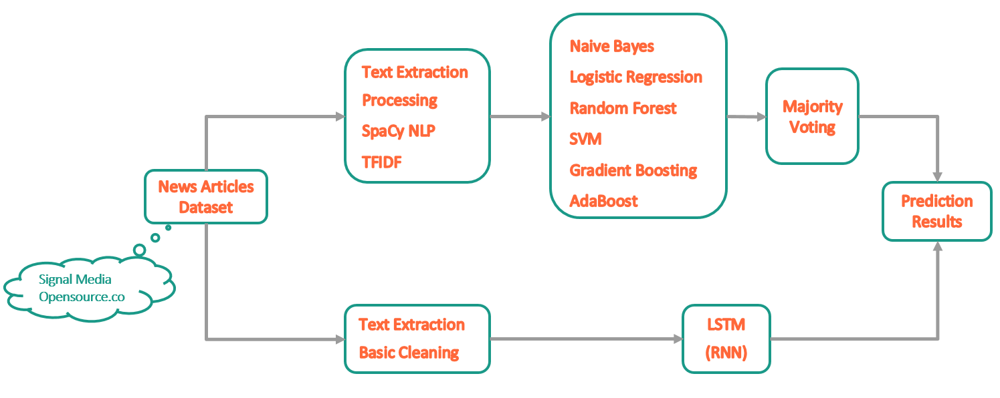
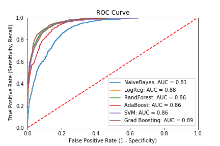

## Using Data Science to Identify Fake News

### Summary 
Fake news misleads readers and manipulates them into believing something that isn’t real. The prevalence of fake news on social media lately became a very big problem. In this project, I worked on detecting fake news using data science and machine learning algorithms. 

### Data 
Dataset published by [Signal Media](https://signalmedia.co/) was used to obtain news articles from a variety of news sources. 'Fake' news sources were identified using [OpenSources](http://www.opensources.co/) and 'Real' news sources were identified using [News API](https://newsapi.org/). Text from news content was cleaned based on content exploration and the [SpaCy](https://spacy.io/) library was used for text cleaning and Named Entity Recognition.

Final dataset was built as a corpus of labeled real and fake news articles and included about 6500 real news and 3200 fake news. Next, TFIDF vectorizer was used along with bi-gram to generate relevant feature matrix

### Models
Various classification models (Naïve Bayes, Logistic Regression, Random Forest, Support Vector Machine, Gradient Boosting and AdaBoost) were implemented and their performance was compared. In addition, results from an ensemble model (majority voting) were also obtained to try and achieve better performance.

### Deep Learning
Since the order of the words can carry useful information in a text classification, I also explored a recurrent neural network (RNN) using LSTM which is considered to work well with serialized data such as text. I transferred original text to a fixed length integer vector and only considered 500 words and padded short length articles with 0. I also used word embedding to transfer each word id to 32-dimension vector. 

### Modeling Flow

### Performance
| MODEL                  | ACCURACY  | F1 SCORE  | PRECISION | RECALL    | AUC       |
|------------------------|-----------|-----------|-----------|-----------|-----------|
| Naive Bayes            | 81.971    | 73.997    | 70.672    | 77.651    | 0.81      |
| Logistic Regression    | 89.320    | 83.692    | 84.444    | 82.952    | 0.88      |
| Random Forest          | 89.148    | 82.405    | 88.729    | 76.923    | 0.86      |
| Support Vector Machine | 88.908    | 82.474    | 86.266    | 79.002    | 0.86      |
| Gradient Boosting      | 91.003    | 85.929    | 88.889    | 83.160    | 0.89      |
| AdaBoost               | 87.054    | 80.736    | 79.397    | 82.121    | 0.86      |
| Ensemble Model         | 91.415    | 86.574    | 89.556    | 83.784    | 0.89      |
| RNN with LSTM          | 89.779    | 84.504    | 85.260    | 83.664    | 0.88      |

Based on these results, many of these models seem to work decently well for the small dataset used, with Gradient Boosting model performing the best. It would be interesting to see the performance of these classification algorithms on a larger and much better dataset. 

### Future Work
  - Gathering more data with better definition of fake news (currently relying on OpenSource tagging)
  - Use of others features (e.g., source, URL, publishing medium etc.) to improve classification 
  - Use pre-trained embedding's such as Word2Vec and GloVe in RNN
  - Learn more on tuning hyper-parameters of deep-learning models

### Tech Used
Python | Pandas | Scikit-learn | SpaCy | NLP | Keras | Matplotlib

### Project link
https://github.com/soniampub/Fake_News_Detection
